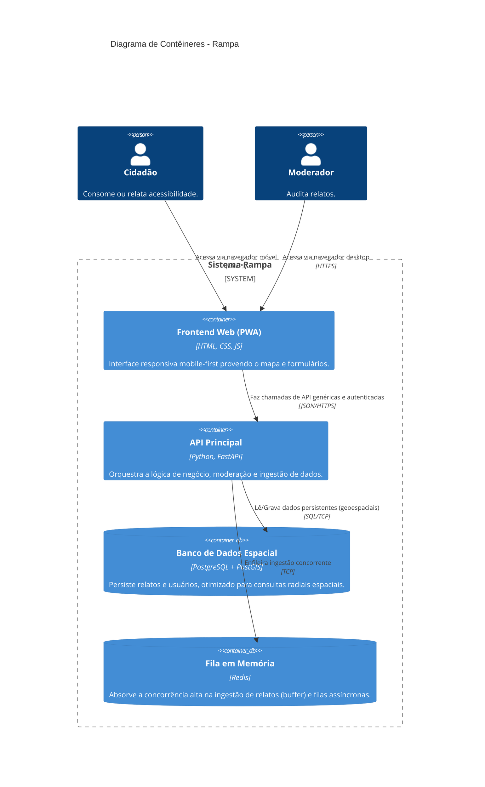

# C4 Nível 2 - Contêineres (Container)

```mermaid
C4Container
  title Diagrama de Contêineres - Rampa

  Person(cidadao, "Cidadão", "Consome ou relata acessibilidade.")
  Person(moderador, "Moderador", "Audita relatos.")

  System_Boundary(rampa_boundary, "Sistema Rampa") {
    Container(pwa, "Frontend Web (PWA)", "HTML, CSS, JS", "Interface responsiva mobile-first provendo o mapa e formulários.")
    Container(api, "API Principal", "Python, FastAPI", "Orquestra a lógica de negócio, moderação e ingestão de dados.")
    ContainerDb(bd, "Banco de Dados Espacial", "PostgreSQL + PostGIS", "Persiste relatos e usuários, otimizado para consultas radiais espaciais.")
    ContainerDb(redis, "Fila em Memória", "Redis", "Absorve a concorrência alta na ingestão de relatos (buffer) e filas assíncronas.")
  }

  Rel(cidadao, pwa, "Acessa via navegador móvel", "HTTPS")
  Rel(moderador, pwa, "Acessa via navegador desktop", "HTTPS")
  Rel(pwa, api, "Faz chamadas de API genéricas e autenticadas", "JSON/HTTPS")
  Rel(api, redis, "Enfileira ingestão concorrente", "TCP")
  Rel(api, bd, "Lê/Grava dados persistentes (geoespaciais)", "SQL/TCP")
```