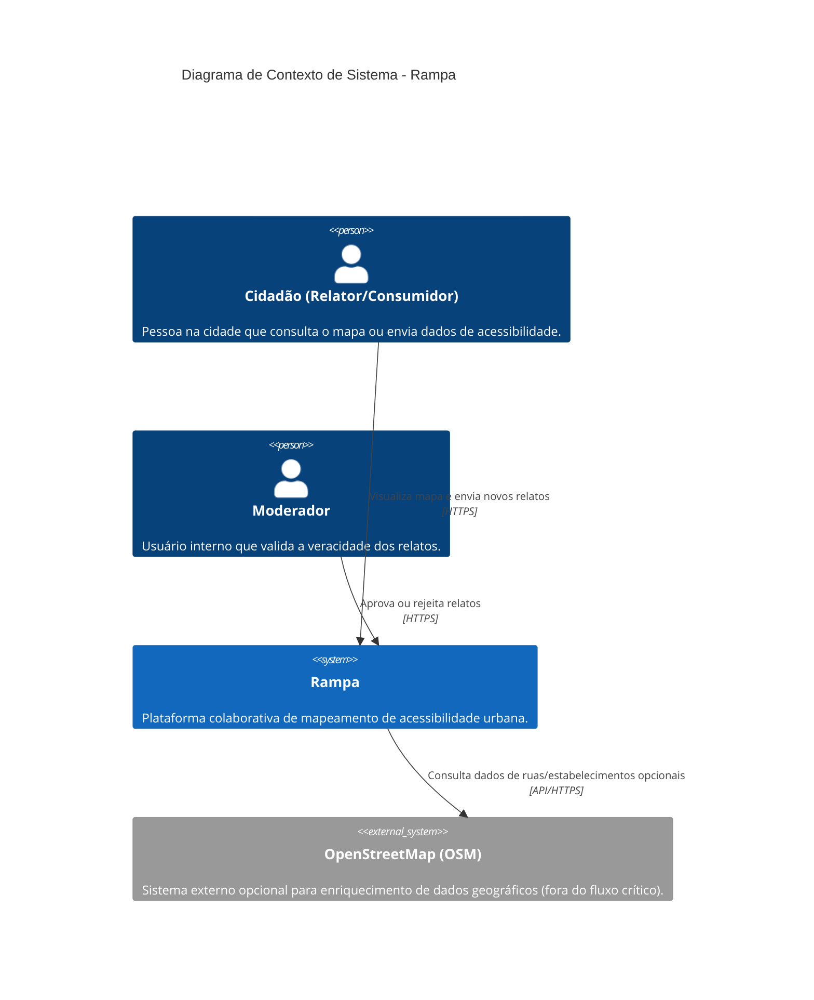

# C4 Nível 1 - Contexto (System Context)

```mermaid
C4Context
  title Diagrama de Contexto de Sistema - Rampa

  Person(cidadao, "Cidadão (Relator/Consumidor)", "Pessoa na cidade que consulta o mapa ou envia dados de acessibilidade.")
  Person(moderador, "Moderador", "Usuário interno que valida a veracidade dos relatos.")
  
  System(rampa, "Rampa", "Plataforma colaborativa de mapeamento de acessibilidade urbana.")
  System_Ext(osm, "OpenStreetMap (OSM)", "Sistema externo opcional para enriquecimento de dados geográficos (fora do fluxo crítico).")

  Rel(cidadao, rampa, "Visualiza mapa e envia novos relatos", "HTTPS")
  Rel(moderador, rampa, "Aprova ou rejeita relatos", "HTTPS")
  Rel(rampa, osm, "Consulta dados de ruas/estabelecimentos opcionais", "API/HTTPS")
```